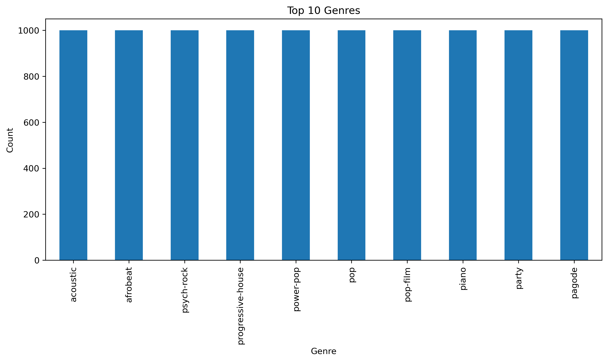
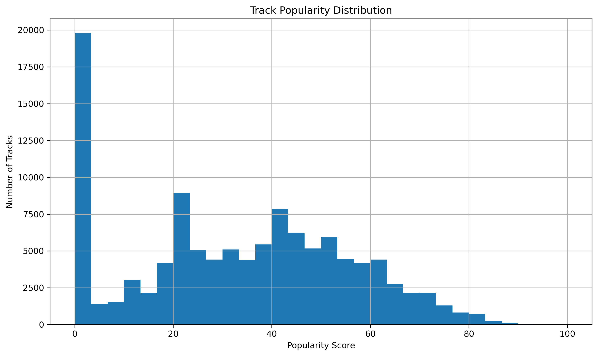
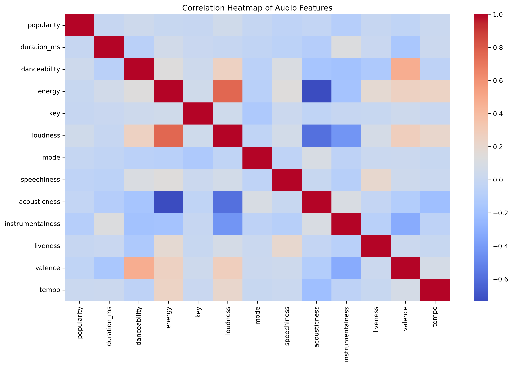

# Spotify Music Trend Analysis

This project analyzes track-level musical features to understand which characteristics contribute to higher popularity on Spotify. The aim is to translate audio feature patterns into insights that are useful for music producers, playlist curators, and marketing teams.

---

## 🎯 Objective
Identify which audio attributes (danceability, energy, loudness, valence, etc.) are associated with more popular tracks, and interpret these findings in a business and music-production context.

---

## 📂 Dataset
- **Source:** Spotify Tracks Dataset (Kaggle)
- **Rows:** ~100,000 tracks
- **Key Columns:** popularity, danceability, valence, tempo, energy, loudness, track_genre, etc.

---

## 🔍 Key Insights

1. **Popularity is highly concentrated.**  
   Only a smaller subset of tracks achieve high popularity scores, suggesting that **marketing, playlist placement, and visibility** play a major role beyond just musical quality.

2. **High-energy and loud tracks tend to perform better.**  
   Popular tracks often have **higher energy and louder dynamic profiles**, indicating that **upbeat, punchy production styles** are more commercially successful.

3. **Musical attributes influence popularity more than genre alone.**  
   The data shows **stronger correlations between popularity and production features** (like loudness, valence, and danceability) than with genre labels, meaning **sound design choices matter more than picking the “right” genre.**

---

## 📊 Visualizations

### Top 10 Genres

### Track Popularity Distribution

### Correlation Between Musical Features

---

## 🛠 Tools & Skills Demonstrated
| Skill | How It Was Used |
|------|----------------|
| **Python (Pandas)** | Data cleaning |
| **Matplotlib / Seaborn** | Trend visualization & insight communication |
| **Exploratory Data Analysis (EDA)** | Identified feature relationships affecting popularity |
| **Business Insight Communication** | Converted technical patterns into actionable meaning |

---

## ✅ What This Project Shows About Me
- Ability to work with a large, real-world dataset
- Ability to extract patterns and convert them into useful insights
- Ability to communicate findings visually and professionally
